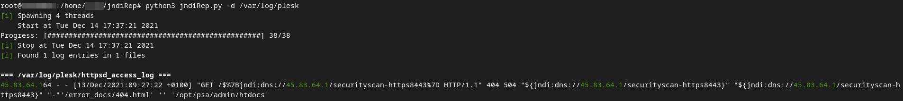
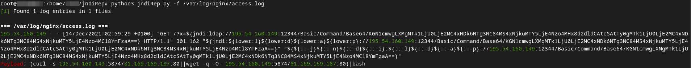

# jndiRep - CVE-2021-44228
Basically a **bad** grep on even **worse** drugs.
- search for malicious strings
- decode payloads
- print results to stdout or file
- report ips (incl. logs) to AbuseIPDB

**jndiRep must be run as superuser**

## How to scan?
Please be aware, that not all applications will log either into `/var/log/...` or even log files. There's no scan option covering all possibilities. Use the following steps to cover most of your log files.
1. **Know your applications:**<br>
If you know what critical systems you're running, you also know where they store their logs. Use `python3 jndiRep.py -d <directory> -o filename.json` to scan each directory. Don't forget to save the results in a file.
2. **Hidden logs:**<br>
You might not be aware of some applications. Luckily, one can find most of them via `lsof | grep \.log`. Use `python3 jndiRep.py -l -o filename.json` to make use of lsof and scan each file found. `lsof` might not find logs like `access.log.1`. You need to figure these directories out if not covered by the first scan, and use the `-d` parameter.
3. **Docker containers:**<br>
If your applications run via Docker, you can make use of the `docker logs <container id>` output. Use `python3 jndiRep.py -D` to scan the log output of each running container.

> If you're missing any scan option, please let me know.

## Scanning
- Directory: `python3 jndiRep.py -d /path/to/directory`
- File: `python3 jndiRep.py -f /path/to/input.txt`
- All logs: `python3 jndiRep.py -l` will use **lsof** to scan for all possible log paths and scan them
- Docker: `python3 jndiRep.py -D` will scan output of `docker logs <id>` for possible attacks
- Custom filter: `python3 jndiRep.py ... -g "ldap"` searches for custom words instead of the default `jndi`
- Ignore words: `python3 jndiRep.py ... -i "jndiRep,test,js-on"` ignores comma separated values in findings
- Threading: If scanning a directory, 4 threads will work on the files in parallel. You can change this by using `-t <threads>`.

## Examples
> 
> `python3 jndiRep.py -d /var/log/plesk`

> 
> `python3 jndiRep.py -f /var/log/nginx/access.log`

## Output
You can either print results to a file or to stdout (includes coloring of IPs and payloads).
- stdout: `python3 jndiRep.py ...`
- file: `python3 jndiRep.py ... -o /path/to/output.txt`
Use *.json* or *.csv* as extension to output data as JSON or CSV, otherwise the output will be the same as stdout. For CSV `|` is used as separator to avoid issues with log lines, but please prefer JSON as it's not affected by weird chars in the findings.

## Reporting
For reporting, an API Key (hex string of length 80) for AbuseIPDB is required, which you can obtain by register at the service and request IP Reporting ability.

- Report IPs once: `python3 jndiRep.py ... -a <api key>`
- Report every occurrence: `python3 jndiRep.py ... -a <api key> --no-dedup`
- Change default comment: `python3 jndiRep.py ... -c "your custom comment"`
- Include logs: `python3 jndiRep.py ... --include-logs`

**Warning**: Reporting is provided "as is". PII will not be cut, decoded payloads will not be uploaded.

## Issues
- Create pull request with your solution
- Open an issue [here](https://github.com/js-on/jndiRep/issues) and I'll try to fix it asap

## Help
```
usage: jndiRep.py [-h] [-a API_KEY] [-d DIRECTORY] [-f FILE] [-l] [-D] [-g GREP] [-i IGNORE] [-o OUTPUT] [-t THREADS] [-r] [-c COMMENT] [-I] [--no-dedup]

optional arguments:
  -h, --help            show this help message and exit
  -a API_KEY, --api-key API_KEY
                        AbuseIPDB Api Key
  -d DIRECTORY, --directory DIRECTORY
                        Directory to scan
  -f FILE, --file FILE  File to scan
  -l, --logs            Use `lsof` to find all .log files and scan them
  -D, --docker          Inspect running containers and scan for log4j activity
  -g GREP, --grep GREP  Custom word to grep for
  -i IGNORE, --ignore IGNORE
                        Custom words to ignore (grep -v)
  -o OUTPUT, --output OUTPUT
                        File to store results. stdout if not set. Use .csv|.json extension for automatic data formatting
  -t THREADS, --threads THREADS
                        Number of threads to start. Default is 4
  -r, --report          Report IPs to AbuseIPDB with category 21 (malicious web request)
  -c COMMENT, --comment COMMENT
                        Comment sent with your report
  -I, --include-logs    Include logs in your report. PII will NOT be stripped of!!!
  --no-dedup            If set, report every occurrence of IP. Default: Report only once.
```